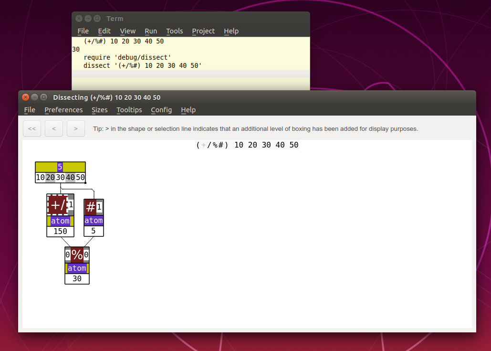

# Linear Algebra as Spreadsheet

[The metaphor isn't mine](https://betterexplained.com/articles/linear-algebra-guide/). But it's a good one!

<blockquote class="twitter-tweet">
Is there an intrinsic reason MATLAB-esque tasks can&#39;t be as WYSIWYG as a spreadsheet?  How do you represent matrix multiplication in a graphical environment? I want to drag and drop my eigendecomposition as tangibly as a sort operation.
&mdash; Max Krieger (@maxkriegers) <a href="https://twitter.com/maxkriegers/status/1246619921896873985?ref_src=twsrc%5Etfw">April 5, 2020</a></blockquote> 

<blockquote class="twitter-tweet">
Some tools on the way to supporting the magical, playful mode of waves:<a href="https://t.co/fa5Sunkwhh">https://t.co/fa5Sunkwhh</a><a href="https://t.co/FQKTRWzyje">https://t.co/FQKTRWzyje</a> and the unimplemented direct manipulation APL-spreadsheet-incantation environment of my dreams <a href="https://t.co/TFxhVS1UIq">https://t.co/TFxhVS1UIq</a>
&mdash; Max Krieger (@maxkriegers) <a href="https://twitter.com/maxkriegers/status/1306129848038027265?ref_src=twsrc%5Etfw">September 16, 2020</a></blockquote> 

So I was wondering why nobody took it literally.

I can't find any existing _direct manipulation_ interfaces to perform linear algebra on raw data. Stuff like eigendecomposition or factorization. Or [constructing proofs of SVD](http://cognitivemedium.com/emm/emm.html).

Here's what I _have_ found:

## APL is really cool

It's a REPL interface, and a really old one. But it's all about performing abstract operations on concrete data. Reminds me of [PANE](http://joshuahhh.com/projects/pane/)'s philosophy: "programming with visible data".

The weird runic incantations like [`r←,⍳⊢ ⋄ (r G) ≡ r ∘.{⍺[⍵]}⍨ ↓r G`](https://www.jsoftware.com/papers/50/50_12.htm) are super charming as well. Sure it's intimidating to look at, but the semantics could perhaps be turned into direct manipulation semantics?

from [Building J from source](https://stranded.io/2019/12/29/building-j-from-source/)

[Here's a bunch of college-level math textbooks where the examples are in APL](https://www.jsoftware.com/books/pdf/). All by Iverson(?).

[Teaching Mathematics Using APL](https://www.tandfonline.com/doi/abs/10.1080/07468342.1986.11972980)

((related: [[microworld-languages]]))

[Performing Operations with Matrices on Spreadsheets](https://www.jstor.org/stable/27970545?seq=1)

### Random implementations of related things

- [BQN: finally, an APL for your flying saucer](https://mlochbaum.github.io/BQN/)
- [Co-dfns](https://github.com/Co-dfns/Co-dfns)
- [A History of APL in 50 Functions](https://www.jsoftware.com/papers/50/)

### Aesthetics

- ["Spectral decomposition? Oh you mean like when a ghost dies?"](https://twitter.com/likethebuilder/status/1326583332306554880?s=19)

"What's my name jack?" in Toki Pona. Some sort of MS Paint adventures thing. No idea what it means. I think I got it from a toki pona subreddit.

### other

- What if there was a set of flashcards to learn all the APL symbols? Like [Elixir Cards](https://elixircards.co.uk/)/[PixelSpirit](https://patriciogonzalezvivo.github.io/PixelSpiritDeck/).

## Direct manipulation refs

- ["Verb-noun vs noun-verb"](https://mobile.twitter.com/tophtucker/status/1278184444428529665?s=19)
- [Mito: Edit a spreadsheet. Generate Python. All in Jupyter.](https://trymito.io/)
- [Responsive Matrix Cells: A Focus+Context Approach for Multivariate Graphs](https://imld.de/en/research/research-projects/responsive-matrix-cells/)

## Semantics refs

- [Graphical Linear Algebra](https://graphicallinearalgebra.net/)
- [An Illustrated Guide to Arquero Verbs / UW Interactive Data Lab / Observable](https://observablehq.com/@uwdata/an-illustrated-guide-to-arquero-verbs)
- [A Grammar of Data Manipulation • dplyr](https://dplyr.tidyverse.org/)

[//begin]: # "Autogenerated link references for markdown compatibility"
[microworld-languages]: microworld-languages.md "Domain-Learning with Computational Microworlds"
[//end]: # "Autogenerated link references"
