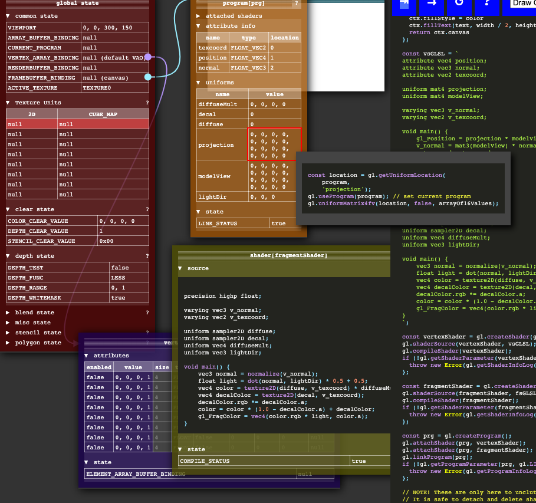
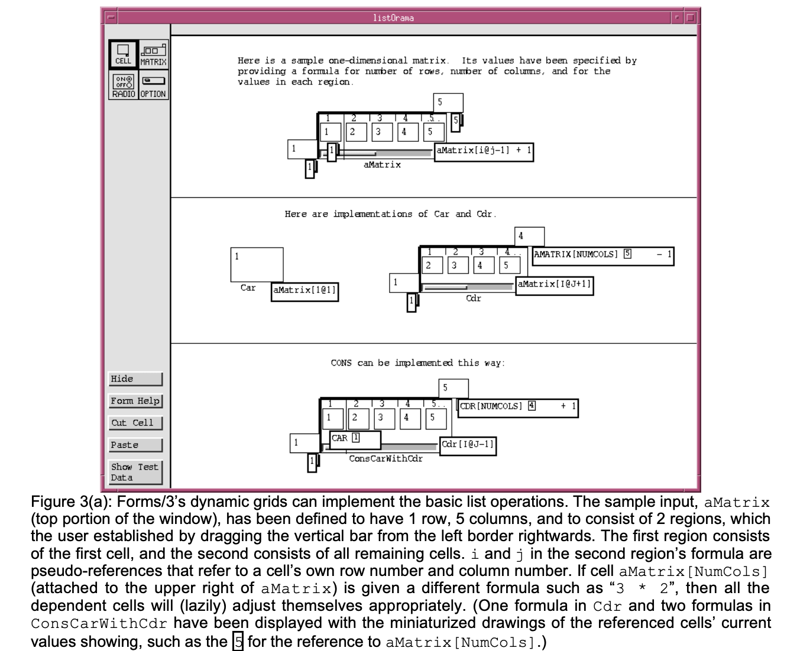

# Linear Algebra as Spreadsheet

_Thanks to Garth Goldwater for a lot of the ideas here_

[The metaphor isn't mine](https://betterexplained.com/articles/linear-algebra-guide/). But it's a good one!

<blockquote class="twitter-tweet">
Is there an intrinsic reason MATLAB-esque tasks can&#39;t be as WYSIWYG as a spreadsheet?  How do you represent matrix multiplication in a graphical environment? I want to drag and drop my eigendecomposition as tangibly as a sort operation.
&mdash; Max Krieger (@maxkriegers) <a href="https://twitter.com/maxkriegers/status/1246619921896873985?ref_src=twsrc%5Etfw">April 5, 2020</a></blockquote> 

<blockquote class="twitter-tweet">
Some tools on the way to supporting the magical, playful mode of waves:<a href="https://t.co/fa5Sunkwhh">https://t.co/fa5Sunkwhh</a><a href="https://t.co/FQKTRWzyje">https://t.co/FQKTRWzyje</a> and the unimplemented direct manipulation APL-spreadsheet-incantation environment of my dreams <a href="https://t.co/TFxhVS1UIq">https://t.co/TFxhVS1UIq</a>
&mdash; Max Krieger (@maxkriegers) <a href="https://twitter.com/maxkriegers/status/1306129848038027265?ref_src=twsrc%5Etfw">September 16, 2020</a></blockquote> 

So I was wondering why nobody took it literally.

I can't find any existing _direct manipulation_ interfaces to perform linear algebra on raw data. Stuff like eigendecomposition or factorization. Or [constructing proofs of SVD](http://cognitivemedium.com/emm/emm.html).

The key, I think, is to map the _language_ of linear algebra to an _interaction semantics_ for linear algebra ([[interaction-semantics]]).

Here's what I _have_ found:

## Excel!?

Sure I guess?

- [Performing Operations with Matrices on Spreadsheets](https://www.jstor.org/stable/27970545?seq=1)

## APL is really cool

It's a REPL interface, and a really old one. But it's all about performing abstract operations on concrete data. Reminds me of [PANE](http://joshuahhh.com/projects/pane/)'s philosophy: "programming with visible data".

The weird runic incantations like [`r←,⍳⊢ ⋄ (r G) ≡ r ∘.{⍺[⍵]}⍨ ↓r G`](https://www.jsoftware.com/papers/50/50_12.htm) are super charming as well. Sure it's intimidating to look at, but the semantics could perhaps be turned into direct manipulation semantics ([[interaction-semantics]])?

from [Building J from source](https://stranded.io/2019/12/29/building-j-from-source/)

[Here's a bunch of college-level math textbooks where the examples are in APL](https://www.jsoftware.com/books/pdf/). All by Iverson(?).

[Teaching Mathematics Using APL](https://www.tandfonline.com/doi/abs/10.1080/07468342.1986.11972980)

(related: [[microworld-languages]])

<blockquote class="twitter-tweet">
roads not taken or uneven distribution? <a href="https://t.co/SQmgowxTKL">pic.twitter.com/SQmgowxTKL</a>
&mdash; andrew blinn (@disconcision) <a href="https://twitter.com/disconcision/status/1357395804332429318?ref_src=twsrc%5Etfw">February 4, 2021</a></blockquote> 

- https://mobile.twitter.com/code_report/status/1367968275125112835
- https://mobile.twitter.com/code_report/status/1368030764718252032

### Random implementations of related things

- [BQN: finally, an APL for your flying saucer](https://mlochbaum.github.io/BQN/)
- [Co-dfns](https://github.com/Co-dfns/Co-dfns)
- [A History of APL in 50 Functions](https://www.jsoftware.com/papers/50/)
- [CoSy](http://cosy.com/CoSy/)
- [april](https://github.com/phantomics/april) - lisp APL

### Aesthetics

- ["Spectral decomposition? Oh you mean like when a ghost dies?"](https://twitter.com/likethebuilder/status/1326583332306554880?s=19)

"What's my name jack?" in Toki Pona. Some sort of MS Paint adventures thing. No idea what it means. I think I got it from a toki pona subreddit.

### other

- What if there was a set of flashcards to learn all the APL symbols? Like [Elixir Cards](https://elixircards.co.uk/)/[PixelSpirit](https://patriciogonzalezvivo.github.io/PixelSpiritDeck/).

One subproject ([[subprojecting]]) is not APL, but some CAS matrix toy - "Linearkit".

- Nicky Case's [transformation matrix toy](https://ncase.me/matrix/)

## Direct manipulation refs

- 2d

<blockquote class="twitter-tweet">
isolate a data column by dragging it out of the table. also got a little semantic text editing going <a href="https://t.co/ZW6ukuk2UK">pic.twitter.com/ZW6ukuk2UK</a>
&mdash; Paul Shen (@_paulshen) <a href="https://twitter.com/_paulshen/status/1366801887341649924?ref_src=twsrc%5Etfw">March 2, 2021</a></blockquote> 

- [WebGL State Diagram](https://webglfundamentals.org/webgl/lessons/resources/webgl-state-diagram.html) - the "cells" are pointers
  - Maybe each matrix is a floating table and you can multiply by constructing a graph of edges?
  - [Graphical Linear Algebra](https://graphicallinearalgebra.net/)
- ["Verb-noun vs noun-verb"](https://mobile.twitter.com/tophtucker/status/1278184444428529665?s=19)
- [Mito: Edit a spreadsheet. Generate Python. All in Jupyter.](https://trymito.io/)
- [Responsive Matrix Cells: A Focus+Context Approach for Multivariate Graphs](https://imld.de/en/research/research-projects/responsive-matrix-cells/)
- [Loglo](https://loglo.app/)
- [Math Inspector](https://mathinspector.com/)
  - > Math inspector makes it easy for anyone to leverage the power of numpy, the most popular computational mathematics library in the world, without needing to know anything about programming or writing any code. “If watching math videos is like going to the movies instead of reading a book, then math inspector is like playing a video game instead of doing your homework.”

[Forms/3](https://pdfs.semanticscholar.org/a074/a04c61f097ee9ad13f9061aee95d1dd0c01f.pdf)

## Semantics refs

- [Graphical Linear Algebra](https://graphicallinearalgebra.net/)
- [An Illustrated Guide to Arquero Verbs / UW Interactive Data Lab / Observable](https://observablehq.com/@uwdata/an-illustrated-guide-to-arquero-verbs)
- [A Grammar of Data Manipulation • dplyr](https://dplyr.tidyverse.org/)

[//begin]: # "Autogenerated link references for markdown compatibility"
[interaction-semantics]: interaction-semantics.md "How do you create an interaction semantics?"
[microworld-languages]: microworld-languages.md "Domain-Learning with Computational Microworlds"
[subprojecting]: subprojecting.md "Downscoping as a skill (subprojecting)"
[juicing]: juicing.md "On Juicing"
[bottom-up]: bottom-up.md "Bottom Up Design"
[//end]: # "Autogenerated link references"

## Why?

- Not sure.
  - Might be internalized trauma taking linear algebra without something that feels nice to use ([[microworld-languages]]).
  - Practitioners make numpy mistakes a lot I bet
  - How do you communicate intuition about [powerful ideas](https://llk.media.mit.edu/courses/readings/Papert-Big-Idea.pdf) in linalg? Are pictures the best we have? What about the _algebra_, and the _data_ embedded in every matrix?
- The semantics of Linear Algebra are pretty well-defined I think? That's why it's an algebra, right?
- I want to do casual mathematics
- Linear Algebra can model a lot of other domains of math. Not to mention it's pretty useful for physics. So maybe the interface paradigm can be juiced into domain-specific applications ([[juicing]], [[bottom-up]]).
