# System Archaeology Seminar

Old authoring systems have a more holistic/comfy feel because they _were_ the system, not the app.

Comparative archaeology. What's easier or harder to do? What's the texture?

**Let's explore these systems together. Let's make things in them. Let's talk about how they _feel_ to use, and how they make you feel.**

**These are usually not text based.** If they are, they have some sort of deep runtime that can be examined live.

<blockquote class="twitter-tweet">
Growing up within a worldview of &quot;apps&quot; and &quot;dev tools&quot; constrains people to see everything in those terms. It can take tremendous unlearning to even be able to /see/ an &quot;authoring is always on&quot; system for what it is. <a href="https://t.co/WJhh5OR44B">https://t.co/WJhh5OR44B</a>
&mdash; Bret Victor (@worrydream) <a href="https://twitter.com/worrydream/status/1036667880778223617?ref_src=twsrc%5Etfw">September 3, 2018</a></blockquote> 

<blockquote class="twitter-tweet">
It&#39;s cool to read about influential old software like Sketchpad but also sad that often they&#39;ve been lost to the sands of time and so we can&#39;t play with them.
&mdash; yoshiki (@yoshikischmitz) <a href="https://twitter.com/yoshikischmitz/status/1274957057884450818?ref_src=twsrc%5Etfw">June 22, 2020</a></blockquote> 

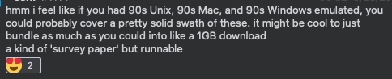

<blockquote class="twitter-tweet">
when talking about systems (OSes, PLs, games, applications), I think reading about them and their history is somewhat overrated, and actually _using_ / playing with them is underrated  (although finding a thing to use them for is often hard)
&mdash; Omar Rizwan (@rsnous) <a href="https://twitter.com/rsnous/status/1290203117649162240?ref_src=twsrc%5Etfw">August 3, 2020</a></blockquote> 

benchmarks: todo list etc

- Emacs and all its "do everything" insanity
  - org-mode
- [Smalltalk Zoo](https://smalltalkzoo.thechm.org/)
- [Squeak](https://squeak.js.org/)
  - Early Scratch?
  - Berkeley Snap!
- Etoys
- [Self](https://selflanguage.org/)
- Forms/3
- Hypercard
- GRAIL
  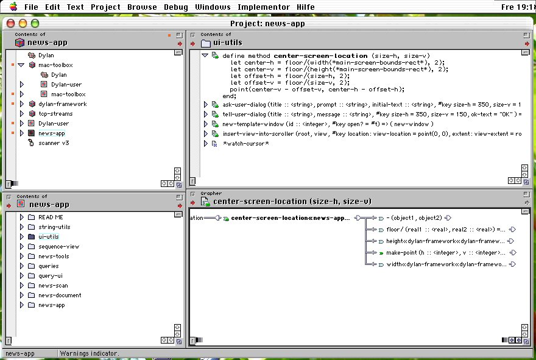

- [Apple Dylan](https://opendylan.org/history/apple-dylan/screenshots/)
- [HyperTIES](http://www.cs.umd.edu/hcil/hyperties/)
- [Plan9](https://merveilles.town/@neauoire/104717468496151278)
  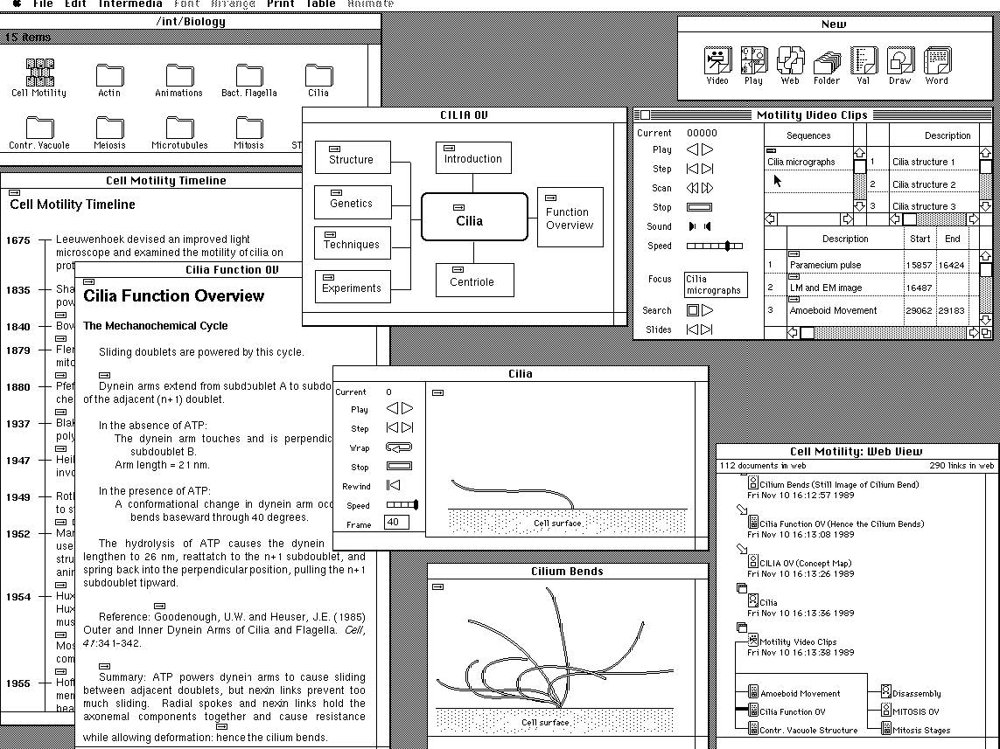

- [IRIS Intermedia System](https://vimeo.com/channels/190946/20662680)
- [NLS Hyperscope](http://codinginparadise.org/ebooks/html/blog/hyperscope_screencast.html)
  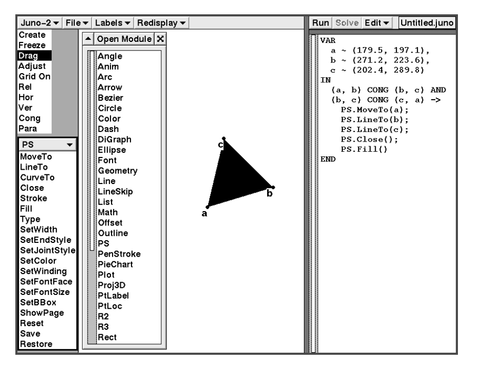

- [JUNO-2](http://citeseerx.ist.psu.edu/viewdoc/summary?doi=10.1.1.37.7482)
- Brad retrospective systems
  

- [Cedar, Mesa, Tioga](https://www.youtube.com/watch?v=z_dt7NG38V4)

  - [Cedar Glossary](http://www.bitsavers.org/pdf/xerox/parc/cedar/Cedar_7.0/02_A_Glossary_of_Terms_Subsystems_Directories_and_Files_May1987.pdf)
    

- [Gargoyle](https://www.youtube.com/watch?v=f0KqT3J67Vw)
  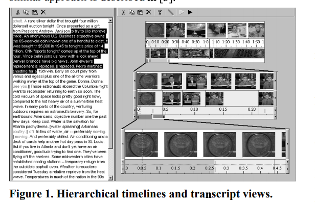
  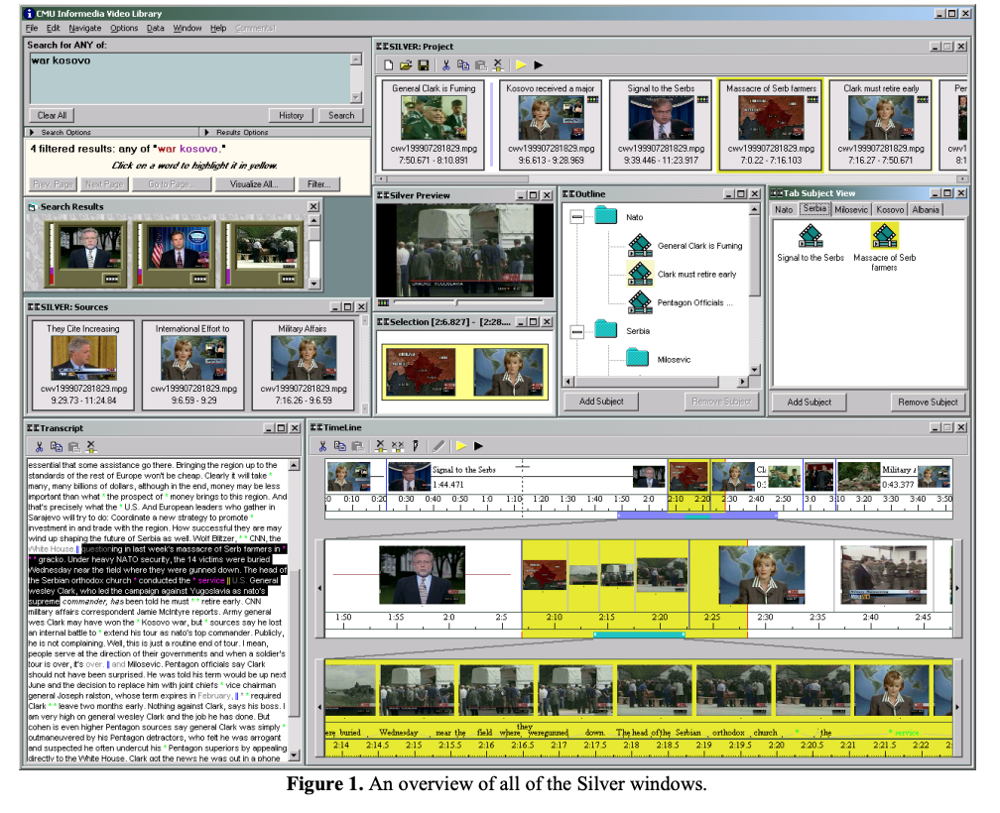
  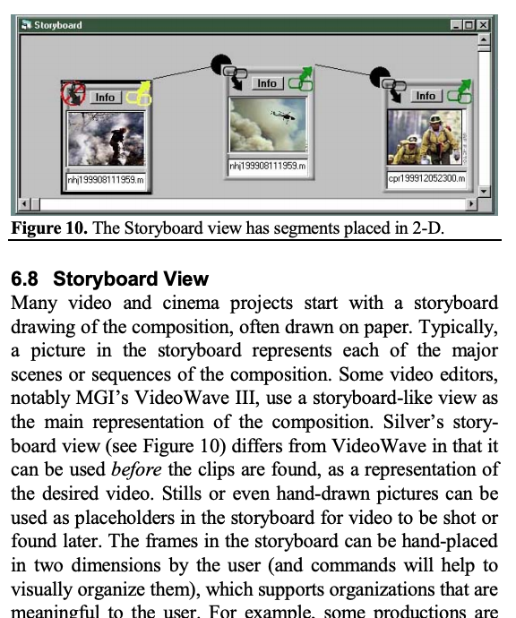

- [The Silver Project](https://www.cs.cmu.edu/afs/cs.cmu.edu/project/silver/www/publications.html)
- [Chorus](http://www.chorus-home.org/) (ok, 2015)
- Subtext
- CDG/HARC
- ThingLab
- Alternate Reality Kit
  

- [Fabrik](http://sp.cmc.msu.ru/courses/smalltalk/fabrik/Fabrik.html)
- [Lively Web](https://lively-web.org/) (not dead yet!)
- [STEPS](http://www.vpri.org/pdf/tr2012001_steps.pdf)
- Xanadu/Zipper?
- [Aardappel](http://strlen.com/aardappel-language/)
- [Bounce](https://donhopkins.medium.com/bounce-stuff-8310551a96e3)
- [Whyline](https://www.cs.cmu.edu/~NatProg/whyline.html) (2005)

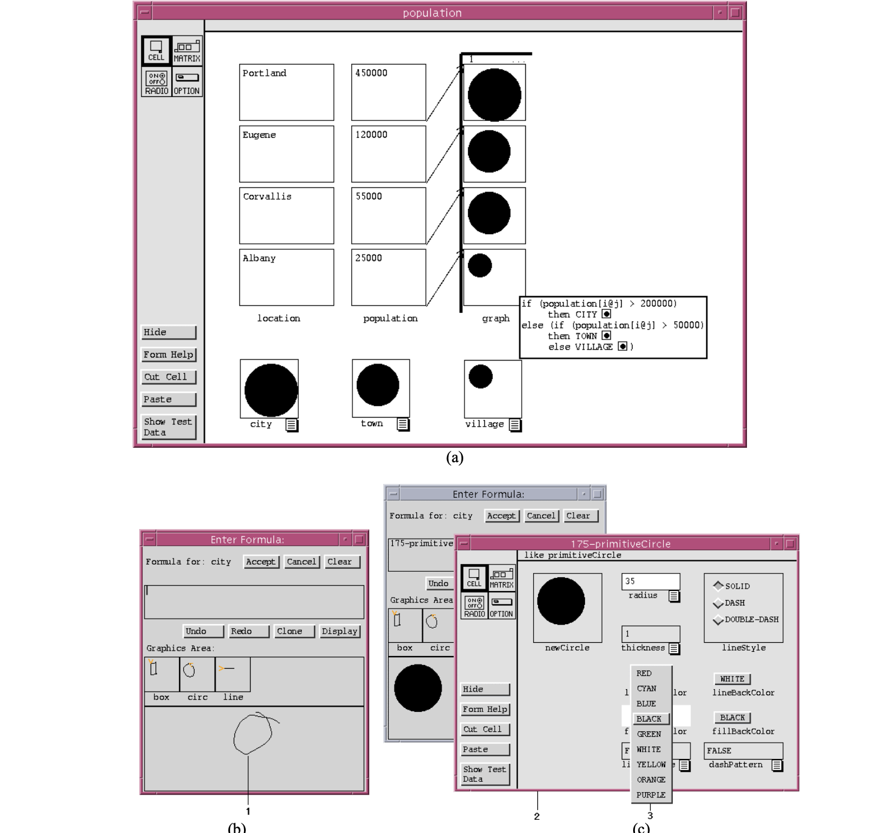

([Forms/3](https://pdfs.semanticscholar.org/a074/a04c61f097ee9ad13f9061aee95d1dd0c01f.pdf))

## Misc

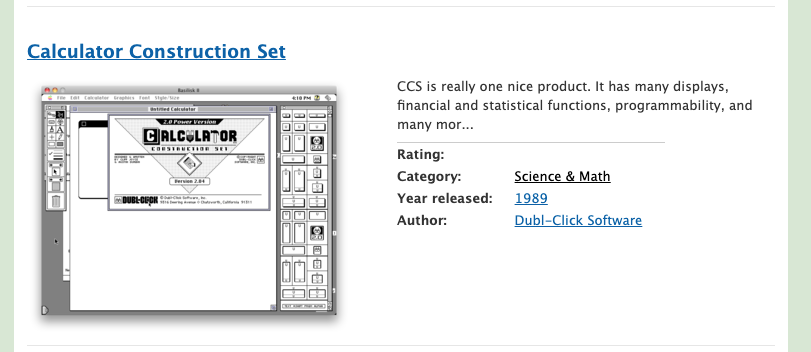
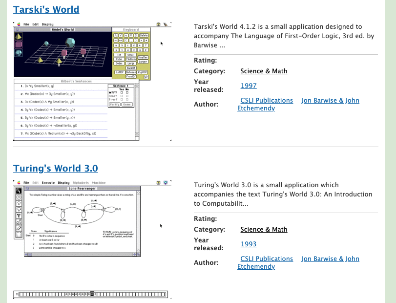

https://macintoshgarden.org/apps/science-math?page=2

Would it be on Hyperlink.academy?

- [**Archaeology of CAD**](http://dcardo.com/projects/archaeology_of_cad/index.html)
- [List of Fantasy Consoles](https://paladin-t.github.io/fantasy/index)
- [Why Hypercard Had to Die](http://www.loper-os.org/?p=568)
- [Byte Magazine Volume 06 Number 08 - Smalltalk](https://archive.org/details/byte-magazine-1981-08)
- [JOY LISI RANKIN: A PEOPLE'S HISTORY OF COMPUTING IN THE UNITED STATES](https://youtu.be/eEU9cwSzaBM?t=1895) (via Yoshiki Schmitz)
- [Kernel Perspective on Twitter](https://twitter.com/unix_byte) finds some great stuff.
  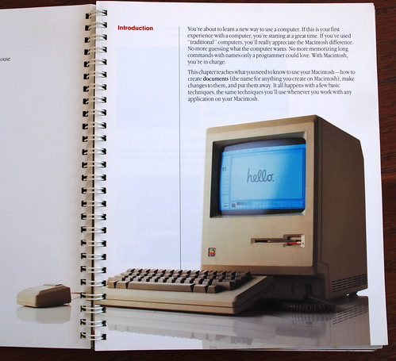

- [Thoughts on (and pics of) the original Macintosh User Manual](https://www.peterme.com/2007/08/27/thoughts-on-and-pics-of-the-original-macintosh-user-manual/)
- [Hypercard Poetry (Hyperpoems)](https://twitter.com/mkirschenbaum/status/1301898638994571266?s=19)
- [Eazel Desktop Environment](https://web.archive.org/web/20000510014027/http://www.eazel.com:80/)
  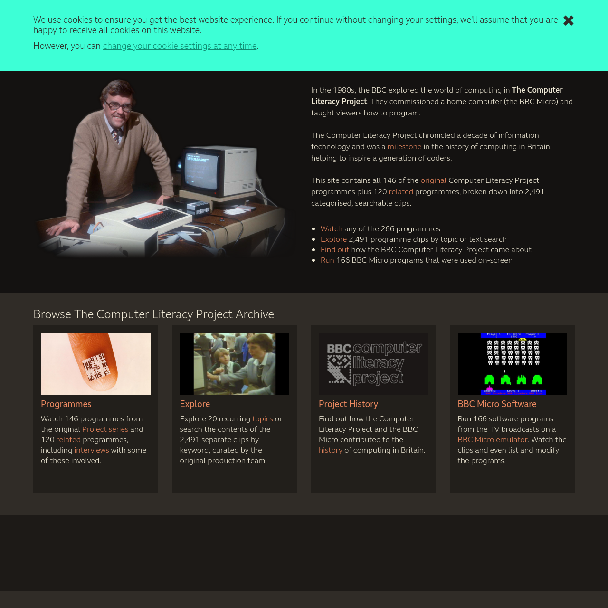

- [BBC Computer Literacy Project](https://clp.bbcrewind.co.uk/) (broken link?)
- [Momenta Smalltalk Tablet](http://kamranelahian.com/project/momenta/)
- [Computer Utopias](http://chrisnovello.com/teaching/risd/computer-utopias/)
- [VPL/Body Electric](http://www.jaronlanier.com/vpl.html)
- mind-bicycles, VPL codex, CHM
- demos, etc
- [Old CHI video list](http://www.cs.umd.edu/hcil/chivideoslist/index.shtml)

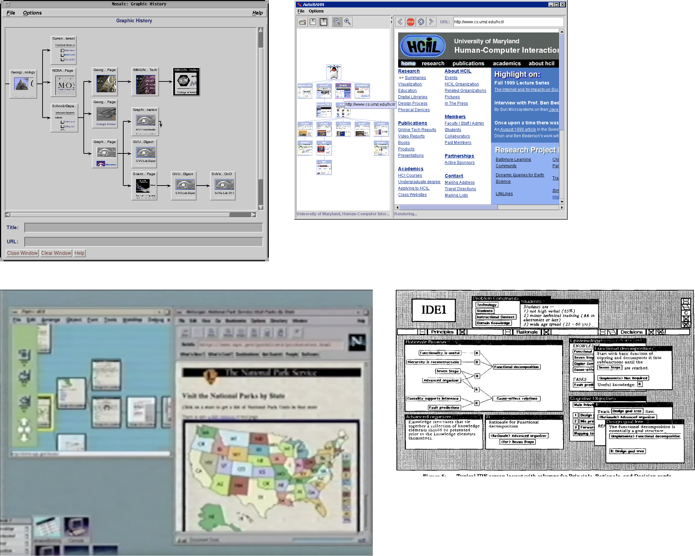

From Yoshiki Schmitz. Sources unknown right now.

### Recapitulating computing

<blockquote class="twitter-tweet">
Here’s the Katz’s History of Mathematics (table of contents and the cover in the tweet below). Every chapter has a bunch of exercises, where you have to show or prove or solve something using the methodologies or number systems used in the chapter. <a href="https://t.co/nRMGQoMcor">https://t.co/nRMGQoMcor</a> <a href="https://t.co/RarQQC8CBQ">pic.twitter.com/RarQQC8CBQ</a>
&mdash; üçìEliüåøvirtual plant makerüåü (@logicsoup) <a href="https://twitter.com/logicsoup/status/1355941297169829888?ref_src=twsrc%5Etfw">January 31, 2021</a></blockquote> 
