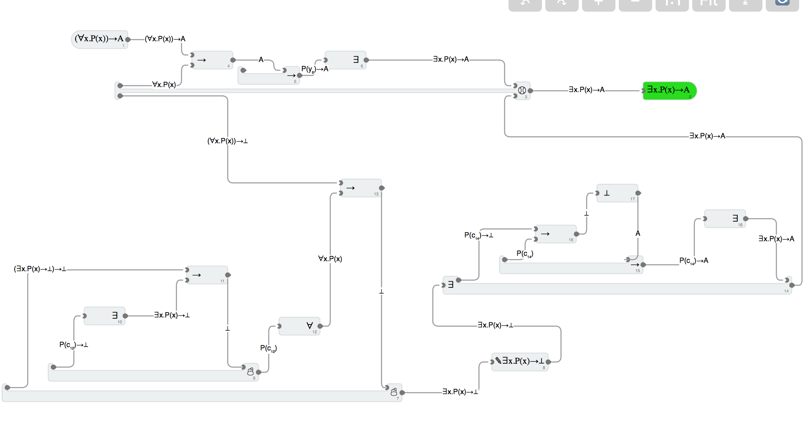

# Why are proof assistants so unfriendly?

Inspired by Katherine Ye's [Proof assistants as a tool for thought](https://www.cs.cmu.edu/~kqy/resources/coq_tools_for_thought.pdf).

Some logic can be a game: see [The Incredible Proof Machine](https://incredible.pm/):

[Goal-directed games](https://www.youtube.com/watch?v=w1_zmx-wU0U) obviously aren't always great though.

## Links

- [Proofscape](https://royalroadmath.org/newpfsc.html)

## What if you could sonify proofs?

Focused theorem plays some loop based on the tree.
